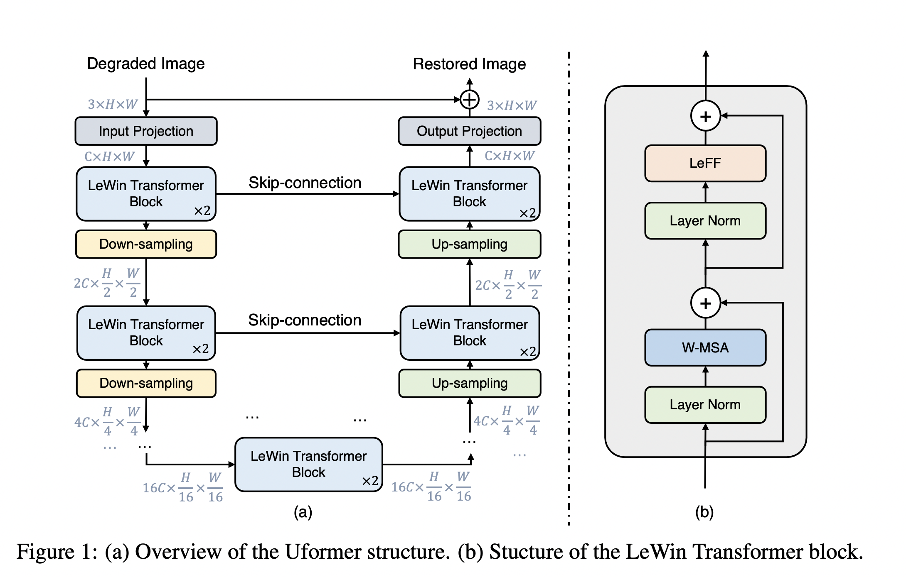
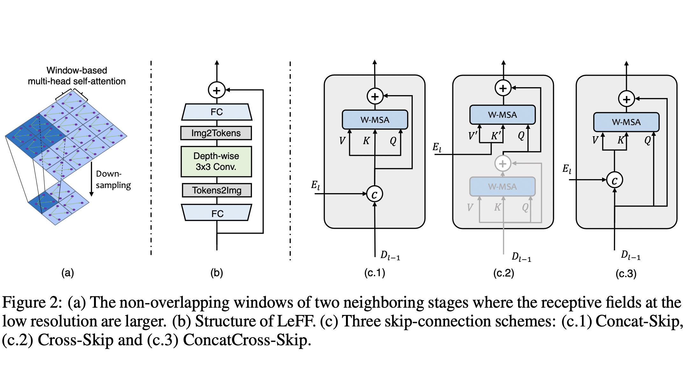

# Uformer: A General U-Shaped Transformer for Image Restoration 
<b>Zhendong Wang, Xiaodong Cun, Jianmin Bao and Jianzhuang Liu</b>

[](https://paperswithcode.com/sota/image-denoising-on-dnd?p=uformer-a-general-u-shaped-transformer-for) [](https://paperswithcode.com/sota/image-denoising-on-sidd?p=uformer-a-general-u-shaped-transformer-for)

Paper: https://arxiv.org/abs/2106.03106


### Update:

* 2021.08.19 Release a pre-trained model(Uformer32)! Add a script for FLOP/GMAC calculation.
* 2021.07.29 Add a script for testing the pre-trained model on the arbitrary-resolution images.

<hr>
<i>In this paper, we present Uformer, an effective and efficient Transformer-based architecture, in which we build a hierarchical encoder-decoder network using the Transformer block for image restoration. Uformer has two core designs to make it suitable for this task. The first key element is a local-enhanced window Transformer block, where we use non-overlapping window-based self-attention to reduce the computational requirement and employ the depth-wise convolution in the feed-forward network to further improve its potential for capturing local context. The second key element is that we explore three skip-connection schemes to effectively deliver information from the encoder to the decoder. Powered by these two designs, Uformer enjoys a high capability for capturing useful dependencies for image restoration. Extensive experiments on several image restoration tasks demonstrate the superiority of Uformer, including image denoising, deraining, deblurring and demoireing. We expect that our work will encourage further research to explore Transformer-based architectures for low-level vision tasks.</i>





## Package dependencies
The project is built with PyTorch 1.7.1, Python3.7, CUDA10.1. For package dependencies, you can install them by:
```bash
pip3 install -r requirements.txt
```

## Pretrained model

- uformer32_denoising_sidd.pth [[Google Drive]](https://drive.google.com/file/d/1dS7Lh46SMbncnwRW9zM5AW3cXrvYkjQU/view?usp=sharing): PSNR 39.77 dB.


## Data preparation 
### Denoising
For training data of SIDD, you can download the SIDD-Medium dataset from the [official url](https://www.eecs.yorku.ca/~kamel/sidd/dataset.php).
Then generate training patches for training by:
```python
python3 generate_patches_SIDD.py --src_dir ../SIDD_Medium_Srgb/Data --tar_dir ../datasets/denoising/sidd/train
```

For evaluation, we use the same evaluation data as [here](https://drive.google.com/drive/folders/1j5ESMU0HJGD-wU6qbEdnt569z7sM3479), and put it into the dir `../datasets/denoising/sidd/val`.

## Training
### Denoising
To train `Uformer32(embed_dim=32)` on SIDD, we use 2 V100 GPUs and run for 250 epochs:

```python
python3 ./train.py --arch Uformer --batch_size 32 --gpu '0,1' \
    --train_ps 128 --train_dir ../datasets/denoising/sidd/train --env 32_0705_1 \
    --val_dir ../datasets/denoising/sidd/val --embed_dim 32 --warmup
```

More configuration can be founded in `train.sh`.

## Evaluation
### Denoising

To evaluate `Uformer32` on SIDD, you can run:

```python
python3 ./test.py --arch Uformer --batch_size 1 --gpu '0' \
    --input_dir ../datasets/denoising/sidd/val --result_dir YOUR_RESULT_DIR \
    --weights YOUR_PRETRAINED_MODEL_PATH --embed_dim 32 
```


## Computational Cost

We provide a simple script to calculate the flops by ourselves, a simple script has been added in `model.py`. You can change the configuration and run it via:

```python
python3 model.py
```

> The manual calculation of GMacs in this repo differs slightly from the main paper, but they do not influence the conclusion. We will correct the paper later.


## Citation
If you find this project useful in your research, please consider citing:

```
@article{wang2021uformer,
	title={Uformer: A General U-Shaped Transformer for Image Restoration},
	author={Wang, Zhendong and Cun, Xiaodong and Bao, Jianmin and Liu, Jianzhuang},
	journal={arXiv preprint 2106.03106},
	year={2021}
}
```

## Acknowledgement

This code borrows heavily from [MIRNet](https://github.com/swz30/MIRNet) and [SwinTransformer](https://github.com/microsoft/Swin-Transformer).


## Contact
Please contact us if there is any question or suggestion(Zhendong Wang ZhendongWang6@outlook.com, Xiaodong Cun vinthony@gmail.com).
